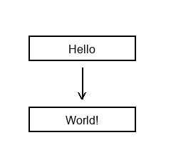
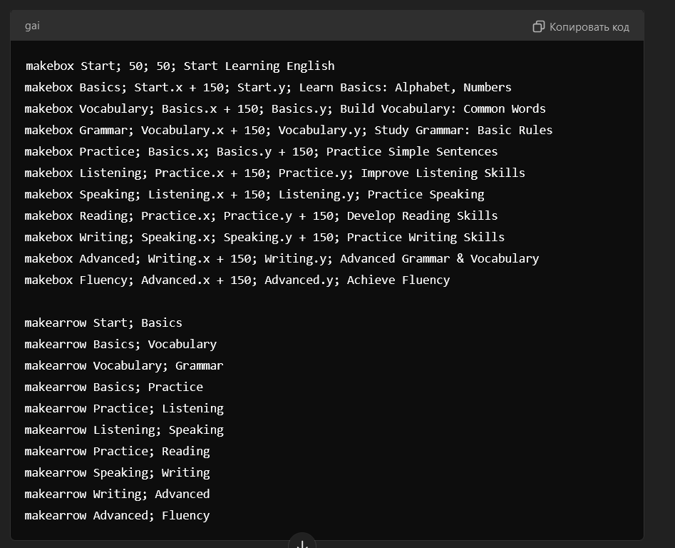

# GAI Syntax for Graph Creation

GAI (Graph AI) is a instructions designed for creating graphs with neural networks. It allows you to easily generate and visualize graphs with simple commands to create boxes and arrows between them.

## Syntax

### Creating a Box

To create a new box, use the `makebox` command. The format is:

```gai
makebox BoxName; XPosition; YPosition; BoxText
```


- **BoxName** — the name of the box.
- **XPosition** — the X coordinate for the box.
- **YPosition** — the Y coordinate for the box.
- **BoxText** — the text that will appear inside the box.

### Creating an Arrow

To create an arrow between two boxes, use the `makearrow` command. The format is:

makearrow Box1; Box2


- **Box1** — the source box.
- **Box2** — the target box.

### Example of Graph Creation

```gai
makebox Box1; 50; 50; Create Easy Graph
makebox Box2; Box1.x + 10; Box1.y + 100; With
makebox Box3; Box2.x + 10; Box2.y + 130; Small Graph Language

makearrow Box1; Box2
makearrow Box2; Box3
```

## Installing

To get started, follow these steps:

1. Install Python 3.10:

   - On Windows, download and install from [python.org](https://www.python.org/downloads/release/python-3100/).
   - On macOS/Linux, you can install Python 3.10 using a package manager:
     - On macOS: `brew install python@3.10`
     - On Ubuntu: `sudo apt install python3.10`

2. Install Pillow:

   Run the following command to install Pillow:
   ```bash
   pip install pillow
   ```

## Running

There are two main ways to run the program:

1. **Run the Example**:

   To run a pre-written example, use the following command:
   ```bash
   python run_example.py
   ```

  This will execute a predefined example to demonstrate the functionality.

2. **Run Your Own Code**:

    To run your own code from a .gai file, use this command:
    ```shell
    python run_file.py your_file.gai
    ```
    Replace your_file.gai with the path to your .gai file containing your code.

That's it! Now you can run either the example or your own code.

#### Explanation:
- **makebox**: Each `makebox` command creates a box at the specified coordinates with the given text inside.
- **makearrow**: The `makearrow` command connects two boxes with an arrow, creating a directional flow from one box to the other.
- **Dynamic Positioning with .x and .y**: These allow you to position boxes relative to others. For example, `Box1.x + 10` and `Box1.y + 100` will position the new box slightly to the right and below the first one.

## Important Notes

### Separating Arguments
Each argument is separated by a semicolon (;) for clarity and consistency in the command structure.

### Graph Creation Tips

- **Box Positioning**: Ensure that the coordinates of the boxes do not overlap. This is crucial for creating a readable and aesthetically pleasing graph. Use `.x` and `.y` for dynamic positioning as new boxes are added.
  
- **Arrow Direction**: Arrows should logically connect the flow of information. Make sure each arrow reflects the intended sequence of actions or events in the graph.

- **Spacing and Layout**: Leave enough space between boxes and arrows to maintain visual clarity. Consider the layout beforehand to avoid a cluttered design.

- **Box Width**: Each box is 120 pixels wide. Keep this in mind when creating your graph to maintain clarity and readability.

## Example Graph Image

Example of how a graph created with GAI might look:



## ChatGPT Code Example



## Prompt

### You can find prompt in prompt.txt but I didn't finalize it

## Other graphs in graphs_example
